# DungeonDelver Final Phase Plan (Milestone 6)

## Scope lock from your latest direction

- Delivery style: **6 milestones**.
- Sync target: **Supabase-based multi-user sync**.
- Immediate production bug to fix first: subsystem config crash (`Cannot read properties of undefined (reading 'map')`).

## What I verified before planning

- Subsystem UI is powered by `[components/modules/ModulePanel.tsx](c:/Users/trist/OneDrive/Dokumente/GitHub/DungeonDelver/dungeon_delver/components/modules/ModulePanel.tsx)` and config types/defaults in `[utils/campaignEngine.ts](c:/Users/trist/OneDrive/Dokumente/GitHub/DungeonDelver/dungeon_delver/utils/campaignEngine.ts)`.
- Current nav is side-by-side but not sticky in UX terms for all breakpoints in `[components/AppShell.tsx](c:/Users/trist/OneDrive/Dokumente/GitHub/DungeonDelver/dungeon_delver/components/AppShell.tsx)`.
- Notes route is message-only in `[app/notes/page.tsx](c:/Users/trist/OneDrive/Dokumente/GitHub/DungeonDelver/dungeon_delver/app/notes/page.tsx)`, separate from journal.
- Journal/Obsidian currently requires manual file open/save in `[app/dm/journal/page.tsx](c:/Users/trist/OneDrive/Dokumente/GitHub/DungeonDelver/dungeon_delver/app/dm/journal/page.tsx)`.
- Campaign hub is quest-centric, not a full player hub in `[app/hub/page.tsx](c:/Users/trist/OneDrive/Dokumente/GitHub/DungeonDelver/dungeon_delver/app/hub/page.tsx)`.

```mermaid
flowchart LR
  subgraph m0 [Milestone0 Stability]
    SubsystemBug[Fix subsystem config crash]
    Baseline[Create system-by-system test doc]
  end
  subgraph m1 [Milestone1 App Shell and Roles]
    StickyNav[Sticky responsive nav]
    RoleModel[DM vs Player roles]
    MainUI[Main UI redesign pass]
  end
  subgraph m2 [Milestone2 Player Hub and Notes]
    PlayerHub[Campaign hub -> full player hub]
    NotesSplit[Messages + personal/session notes]
    BannerBoost[Dominant class banner treatment]
  end
  subgraph m3 [Milestone3 DM and Story Tools]
    DMScreen[DM screen refinement]
    SessionPrep[Session and encounter prep revision]
    Storyline[Storyline creator]
    LoreJournal[Lore and journal refinement]
    ObsidianAuto[Obsidian vault auto-linking]
  end
  subgraph m4 [Milestone4 Combat and VTT]
    CombatUI[Combat tracker redesign]
    VTTReview[VTT architecture/UI review and rework]
    MobileDisplay[Mobile-first display pass]
  end
  subgraph m5 [Milestone5 Sync and Cleanup]
    SupabaseSync[Supabase multi-user sync]
    DeadCode[Dead code removal]
    SyncDocs[Sync behavior explanation docs]
  end

  m0 --> m1 --> m2 --> m3 --> m4 --> m5
```

---

## Milestone 0 — Stability + test-document foundation (start here)

1. **Subsystem crash fix**
  - Guard every `.map` usage in module config UIs with normalized array defaults from `MODULE_CONFIG_DEFAULTS` and runtime schema checks.
  - Harden data shape handoff between `[app/dm/modules/page.tsx](c:/Users/trist/OneDrive/Dokumente/GitHub/DungeonDelver/dungeon_delver/app/dm/modules/page.tsx)` and `[components/modules/ModulePanel.tsx](c:/Users/trist/OneDrive/Dokumente/GitHub/DungeonDelver/dungeon_delver/components/modules/ModulePanel.tsx)`.
2. **Create testing document (system-by-system, function-by-function)**
  - New document in repo docs (for example `docs/test-matrix-final-phase.md`) with:
    - System inventory (Wizard, Sheet, Combat, DM, Hub, VTT, Sync).
    - Key functions per file, expected behavior, edge cases, regression checks.
    - Manual test scripts + acceptance criteria for each milestone.

---

## Milestone 1 — Main UI revamp + sticky navigation + role framework

1. **Main UI redesign pass**
  - Introduce app-wide layout primitives (header/content/footer cards) and replace fragmented route-by-route styling.
2. **Sticky navigation**
  - Refactor `[components/AppShell.tsx](c:/Users/trist/OneDrive/Dokumente/GitHub/DungeonDelver/dungeon_delver/components/AppShell.tsx)` to sticky side/top nav behavior, with responsive collapse.
3. **Role-based programming foundation (DM / Player)**
  - Add role context + route guards:
    - DM-only screens (`/dm`, module config, encounter authoring).
    - Player-first screens (hub, character, notes).
  - Add role switch for local single-device mode.

---

## Milestone 2 — Full player hub + notes redesign + sheet visual priority

1. **Campaign hub -> full player hub**
  - Expand `[app/hub/page.tsx](c:/Users/trist/OneDrive/Dokumente/GitHub/DungeonDelver/dungeon_delver/app/hub/page.tsx)` to include:
    - Active character cards, quest/storyline status, party updates, recent events.
2. **Notes section beyond messages**
  - Split `[app/notes/page.tsx](c:/Users/trist/OneDrive/Dokumente/GitHub/DungeonDelver/dungeon_delver/app/notes/page.tsx)` into tabs:
    - DM/Player messages
    - Personal notes
    - Session notes quick pad
3. **Character sheet class banner dominance**
  - Increase banner prominence in `[app/character-sheet/page.tsx](c:/Users/trist/OneDrive/Dokumente/GitHub/DungeonDelver/dungeon_delver/app/character-sheet/page.tsx)`: stronger hero art, layered overlays, responsive scaling.

---

## Milestone 3 — DM screen, prep tools, storylines, lore/journal, Obsidian automation

1. **DM screen refinement**
  - Improve information hierarchy and quick-actions on DM routes.
2. **Session + encounter prep revision**
  - Rework prep flow into template -> populate -> run.
3. **Storyline creation system**
  - Add storyline entities and board/list views (status, arcs, linked sessions, NPC ties).
4. **Lore & journal refinement**
  - Upgrade `[app/dm/journal/page.tsx](c:/Users/trist/OneDrive/Dokumente/GitHub/DungeonDelver/dungeon_delver/app/dm/journal/page.tsx)` with structured entries and backlinks.
5. **Obsidian full-vault auto-linking (no manual import)**
  - Store vault root once, auto-scan markdown tree, auto-index and create references in-app without explicit import step.

---

## Milestone 4 — Combat UI redesign + VTT revisit + mobile display

1. **Combat tracker UI overhaul**
  - Redesign cards/initiative/controls for speed and clarity; role-aware controls.
2. **VTT review and redesign**
  - Reassess `[app/vtt/page.tsx](c:/Users/trist/OneDrive/Dokumente/GitHub/DungeonDelver/dungeon_delver/app/vtt/page.tsx)`: map layers, token interactions, fog tools, session link points.
3. **Mobile display pass**
  - Convert core routes to mobile-first layout patterns and gesture-friendly controls.

---

## Milestone 5 — Supabase sync + dead code removal + explanation docs

1. **Supabase sync refinement**
  - Add sync models for characters, sessions, encounters, storylines, notes.
  - Define conflict rules (last-write vs merge per entity type).
2. **Sync explanation and operator docs**
  - Create docs that explain offline mode, sync queue, conflict behavior, and troubleshooting.
3. **Dead code elimination across full codebase**
  - Run code audit, remove unused components/utils/routes safely with regression checks from the test matrix.

---

## Cross-cutting acceptance criteria

- No runtime crash in module configuration (fix verified).
- Role-based visibility works on all nav destinations.
- Player hub fully replaces current campaign hub behavior.
- Notes route contains both messaging and durable notes.
- Combat and VTT each complete one redesign iteration with documented UX goals.
- Supabase sync has a written operational model and tested conflict behavior.
- Dead code cleanup documented with before/after inventory.

## Execution order recommendation

1. M0 stability + test doc
2. M1 shell/roles/main UI
3. M2 player-facing upgrades
4. M3 DM/story/lore/Obsidian
5. M4 combat/VTT/mobile
6. M5 sync/docs/cleanup